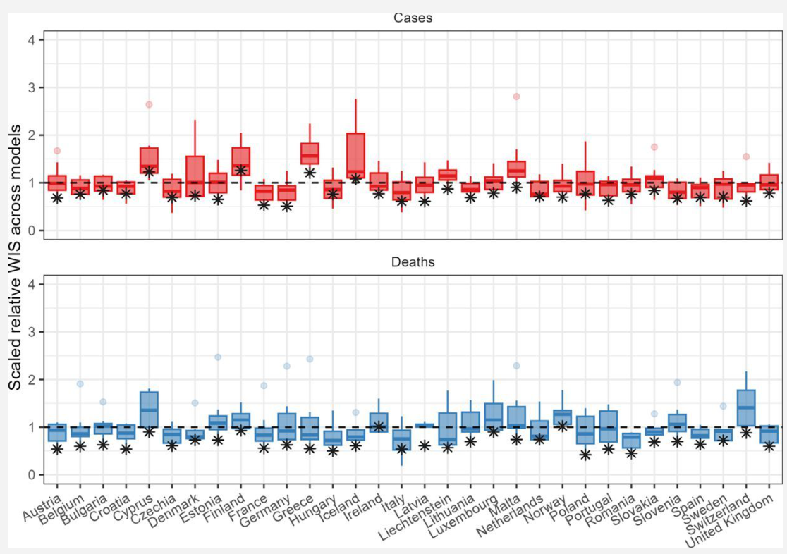

```{r}
#| label: setup
#| include: false

library(here)
library(dplyr)
library(tidyr)
library(purrr)
library(ggplot2)
library(patchwork)
theme_set(theme_classic(base_size = 16))
source(here("R", "process-data.R"))
source(here("R", "analysis-descriptive.R"))
source(here("R", "plot-model-results.R"))

scores <- process_data(scoring_scale = "log") |>
  filter(!grepl("EuroCOVIDhub-ensemble", Model))
results <- readRDS(here("output", "log", "results.rds"))

eff <- results$effects |>
  mutate(ratio = exp(value), lo = exp(lower_2.5), hi = exp(upper_97.5))
adj <- function(g) eff$ratio[eff$model == "Adjusted" & eff$group == g]
unadj <- function(g) eff$ratio[eff$model == "Unadjusted" & eff$group == g]
adj_range <- range(sapply(plot_config$method_levels, adj))

n_models <- n_distinct(scores$Model)
n_forecasts <- nrow(scores)
method_n <- scores |> distinct(Model, Method) |> count(Method)
n_rare <- sum(method_n$n[method_n$Method %in% c("Judgement", "Agent-based")])

ranks <- rank_models(results$effects)
rank_summary <- summarise_ranks(ranks)
```

```{r}
#| label: ojs-data
#| include: false

# Everything the interactive slides need, passed to Observable once.

# Sparsity explorer: strata that a stratified analysis would face, for every
# subset of the categorical covariates
strata_vars <- c(
  "Outcome" = "epi_target", "Horizon" = "Horizon", "Country" = "Location",
  "Trend" = "Trend", "Variant phase" = "VariantPhase",
  "Single/multi-country" = "CountryTargets", "Model structure" = "Method"
)
var_subsets <- map(0:length(strata_vars),
                   \(k) combn(names(strata_vars), k, simplify = FALSE)) |>
  list_flatten()
sparsity <- map(var_subsets, \(labs) {
  if (length(labs) == 0) {
    return(tibble(key = "", possible = 1, filled = 100,
                  median_n = n_forecasts, pct_thin = 0))
  }
  vars <- unname(strata_vars[labs])
  obs <- count(scores, across(all_of(vars)))
  possible <- prod(map_int(scores[vars], n_distinct))
  tibble(
    key = paste(sort(labs), collapse = "|"),
    possible = possible,
    filled = round(nrow(obs) / possible * 100),
    median_n = median(obs$n),
    pct_thin = round(mean(obs$n < 5) * 100)
  )
}) |>
  list_rbind()

# Participation: models forecasting each country-week, 1 week ahead.
# Every included model forecast all four horizons, so one horizon suffices.
participation <- scores |>
  filter(Horizon == 1) |>
  distinct(epi_target, Location, forecast_date, Method, Model)
participation <- bind_rows(
  count(participation, epi_target, Location, forecast_date, Method),
  count(participation, epi_target, Location, forecast_date) |>
    mutate(Method = "All structures")
) |>
  mutate(forecast_date = as.character(forecast_date))

ojs_define(
  sparsity = sparsity,
  varLabels = names(strata_vars),
  participation = participation,
  ranks = select(ranks, label, classification, rank_unadjusted, rank_adjusted,
                 rank_change),
  methodLevels = plot_config$method_levels,
  methodColours = unname(plot_config$method_colours[plot_config$method_levels])
)
```

##

::: {.roadmap}
::::: {.step .theory}
[Theory 1]{.tag} Evaluating forecasts
:::::
::::: {.step .data}
[Data 1]{.tag} Hubs, set up to evaluate
:::::
::::: {.step .theory}
[Theory 2]{.tag} Handling confounding
:::::
::::: {.step .data}
[Data 2]{.tag} Hubs are sparse
:::::
::::: {.step .theory}
[Theory 3]{.tag} Use a regression
:::::
::::: {.step .data}
[Data 3]{.tag} Results
:::::
::::: {.step .theory}
[Theory 4]{.tag} Conceptual limitations
:::::
::::: {.step .data}
[Data 4]{.tag} Sensitivity
:::::
:::

## Questions about evaluating forecasts

Original title:

> The influence of model structure and geographic specificity on predictive accuracy

Now:

> Interpreting variation in infectious disease forecast performance with model-based evaluation

## Key processes generating variation in predictive performance

[Theory 1 · Evaluating forecasts]{.crumb}

```{dot}
//| fig-width: 11
//| fig-height: 3.4

digraph processes {
  graph [rankdir = TB, fontname = "Helvetica", bgcolor = "transparent", nodesep = 0.2]
  node  [shape = box, fontname = "Helvetica", fontsize = 16]
  subgraph cluster_FG {
    label = "Forecast-generating process"; fontname = "Helvetica"; fontsize = 16
    F1 [label = "Model specification"]
    F2 [label = "Model implementation"]
    F3 [label = "Forecaster participation"]
  }
  subgraph cluster_TG {
    label = "Target-generating process"; fontname = "Helvetica"; fontsize = 16
    T1 [label = "Epidemic dynamics"]
    T2 [label = "Target observation"]
    T3 [label = "Target specification"]
  }
  F [label = "Prediction"]
  T [label = "Target"]
  P [label = "Forecast performance"]
  F1 -> F; F2 -> F; F3 -> F
  F -> P
  T1 -> T; T2 -> T; T3 -> T
  T -> P
}
```

::: {.smaller-text}
Every score is a prediction meeting a target, with variation on both sides:

- The target side is well described (stable dynamics, larger populations, timely surveillance and short horizons all help)
- Studies disagree on whether model structure matters
:::

## Forecast Hubs, set up to collect comparable short-term forecasts

[Data 1 · Hubs, set up to evaluate]{.crumb}

::: {.columns}
::::: {.column width="40%" .smaller-text}
- Open call: any team, any method
- Standard format: 23 quantiles, 1-4 weeks ahead
- Teams choose which targets to forecast
- European COVID-19 Forecast Hub, March 2021 to March 2023

`r n_models` models, 32 countries, 2 outcomes, `r format(n_forecasts, big.mark = ",")` forecasts, scored with the weighted interval score on log counts per 100,000 (LWIS).
:::::
::::: {.column width="60%"}
{fig-alt="Boxplots of relative WIS across models for each of 32 countries, cases and deaths, with the ensemble marked"}

[Relative WIS across models against a persistence baseline, 2 weeks ahead, 2021-2022.
\* = ensemble.
Sherratt et al.
2023, eLife.]{.caption}
:::::
:::

## Aggregated performance varied more with the process being predicted than between forecasters

[Data 1 · Hubs, set up to evaluate]{.crumb}

```{r}
#| label: plot-error-vs-obs
#| fig-width: 11
#| fig-height: 4.6

plot_error_vs_obs_bands(scores)
```

Crude performance shows one consistent thing: the target and the horizon matter.
Deaths score better than cases on the log scale, and every outcome gets worse further ahead.

## Approaches to controlling variation in comparative forecast evaluation {.smaller}

[Theory 2 · Handling confounding]{.crumb}

::: {.approaches}
  | Threat to validity            | Approach                 | Example in forecast evaluation                              | Limitation                                                              |
  | ---                           | ---                      | ---                                                         | ---                                                                     |
  | None                          | Unadjusted comparison    | Rank models over all forecasts as submitted                 | Mixes up the method with the difficulty of the targets each model chose |
  | Confounding, selection        | Inclusion criteria       | Exclude forecasts without comparable uncertainty            | Loses power; narrows the population                                     |
  | Confounding                   | Matching                 | Compare forecasters only on targets both submitted          | Sparse overlap; holds only for the matched set                          |
  | Confounding                   | Stratification           | Scores by horizon, location or epidemic phase               | Cells sparse with several factors; continuous covariates need binning   |
  | Differential population sizes | Indirect standardisation | Relative skill against a baseline available for all targets | Depends on the reference, which changes rankings                        |
  | Confounding, clustering       | Regression adjustment    | Partial effect of structure, adjusting for the target       | Specification-dependent; estimand informal                              |
:::

Rows run from no control to full adjustment, each borrowed from observational study design.

## Participation varied by country, over time, and by model structure {.smaller}

[Data 2 · Hubs are sparse]{.crumb}

```{ojs}
//| panel: input

viewof pMethod = Inputs.select(["All structures", ...methodLevels], {label: "Structure"})
viewof pOutcome = Inputs.radio(["Cases", "Deaths"], {value: "Cases", label: "Outcome"})
```

```{ojs}
partT = transpose(participation)
Plot.plot({
  width: 1000, height: 340, marginLeft: 40,
  x: {label: "Week, March 2021 to March 2023", ticks: []},
  y: {label: null},
  color: {type: "sequential", scheme: "viridis", label: "Models forecasting 1 week ahead", legend: true},
  marks: [
    Plot.cell(partT.filter(d => d.Method === pMethod && d.epi_target === pOutcome),
      {x: "forecast_date", y: "Location", fill: "n", inset: 0, tip: true})
  ]
})
```

One week ahead shown.
Every included model forecast all four horizons, so the other horizons look the same.
Median participation: 3% of available targets per model.

::: notes
Click through the structures.
Agent-based and judgement cover only a handful of countries and weeks.
:::

## Stratification would produce sparse data {.smaller}

[Data 2 · Hubs are sparse]{.crumb}

```{ojs}
viewof strataBy = Inputs.checkbox(varLabels, {value: varLabels, label: "Stratify by"})
```

```{ojs}
sparsityT = transpose(sparsity)
sRow = sparsityT.find(d => d.key === [...strataBy].sort().join("|"))
html`<div class="stats">
  <div><span>${sRow.possible.toLocaleString()}</span>possible strata</div>
  <div><span>${sRow.filled}%</span>contain any forecast</div>
  <div><span>${sRow.median_n.toLocaleString()}</span>median forecasts per filled stratum</div>
  <div><span>${sRow.pct_thin}%</span>of filled strata hold fewer than 5</div>
</div>`
```

Untick covariates to see how fast the sample thins.
Continuous covariates (incidence, horizon) would need binning on top.

::: notes
Ask the room: which two covariates would you drop first?
Try it live.
Country and variant phase do the most damage.
:::

## Model-based analysis {.smaller .model-slide}

[Theory 3 · Use a regression]{.crumb}

Generalised additive mixed model of each forecast's LWIS (Tweedie, log link).
Effects are ratios against the average score: 0.8 is 20% better than average.

::: {.columns}
::::: {.column width="50%"}
  | Target-generating       | Enters as        |
  | ----------------------- | ---------------- |
  | Outcome (cases, deaths) | Fixed effect     |
  | Epidemic trend          | Random intercept |
  | Variant phase           | Random intercept |
  | Country                 | Random intercept |
  | Incidence level         | Smooth           |
:::::
::::: {.column width="50%"}
  | Forecast-generating     | Enters as                 |
  | ----------------------- | ------------------------- |
  | Structure × outcome     | Random intercept per cell |
  | Single or multi-country | Random intercept          |
  | Horizon                 | Smooth per model          |
  | Individual model        | Random intercept          |
:::::
:::

Random effects shrink sparse groups towards the average.
With `r n_models` models, the effective sample for structure is `r n_models`, not `r format(n_forecasts, big.mark = ",")`.

## Adjusting for the forecasting context alters the interpretation of variation

[Data 3 · Results]{.crumb}

```{r}
#| label: plot-structure-adj
#| fig-width: 11
#| fig-height: 4.2

eff |>
  filter(group_var == "Method") |>
  mutate(
    group = factor(group, levels = rev(plot_config$method_levels)),
    model = factor(model, levels = c("Unadjusted", "Adjusted"))
  ) |>
  ggplot(aes(y = group, colour = group)) +
  geom_vline(xintercept = 1, lty = 2, alpha = 0.4) +
  geom_linerange(aes(xmin = lo, xmax = hi), lwd = 2, alpha = 0.5) +
  geom_point(aes(x = ratio), size = 3) +
  scale_x_log10() +
  scale_colour_manual(values = plot_config$method_colours, guide = "none") +
  facet_wrap(~model) +
  labs(x = "Performance ratio (below 1 = better than average)", y = NULL) +
  theme(strip.background = element_blank(), strip.text = element_text(size = 16))
```

Unadjusted, judgement looks `r round((1 - unadj("Judgement")) * 100)`% better than average.
Adjusted, every structure sits between `r sprintf("%.2f", adj_range[1])` and `r sprintf("%.2f", adj_range[2])`, all intervals spanning 1.

::: notes
Judgement and agent-based are `r n_rare` of `r n_models` models and under 5% of forecasts.
:::

## Differences between model structures were modified by epidemiological outcome

[Data 3 · Results]{.crumb}

::: {.columns}
::::: {.column width="60%"}
```{r}
#| label: plot-method-target
#| fig-width: 6.5
#| fig-height: 4.6

plot_method_target(results$method_by_target)
```
:::::
::::: {.column width="40%" .smaller-text}
> We noted that differences between outcomes largely offset when averaged.
> An averaged estimate therefore gives close to zero for most structures, whether or not outcome-specific differences exist.

::::::: {.margin-note}
Agent-based, the widest split, rests on 3 models for cases and 2 for deaths.
A Gaussian refit reverses the direction for two of five structures.
:::::::
:::::
:::

## Wider influences on forecast performance

[Data 3 · Results]{.crumb}

```{r}
#| label: plot-all-effects
#| fig-width: 12
#| fig-height: 5

effects_adj <- eff |>
  filter(model == "Adjusted", group_var != "Model", group_var != "Epi_target") |>
  mutate(
    panel = recode(group_var,
      Trend = "Trend", VariantPhase = "Variant phase", Location = "Country",
      Method = "Model structure", CountryTargets = "Single or multi-country"
    ),
    process = if_else(group_var %in% c("Method", "CountryTargets"),
                      "Forecast-generating", "Target-generating")
  )

plot_panel <- function(d, highlight) {
  d |>
    mutate(group = reorder(group, ratio),
           hl = panel %in% highlight) |>
    ggplot(aes(y = group, colour = hl)) +
    geom_vline(xintercept = 1, lty = 2, alpha = 0.4) +
    geom_linerange(aes(xmin = lo, xmax = hi), lwd = 1.5, alpha = 0.5) +
    geom_point(aes(x = ratio), size = 1.8) +
    scale_x_log10(limits = c(0.45, 2.2)) +
    scale_colour_manual(values = c(`TRUE` = "#993404", `FALSE` = "grey55"),
                        guide = "none") +
    facet_grid(rows = vars(panel), scales = "free_y", space = "free_y") +
    labs(x = NULL, y = NULL) +
    theme_classic(base_size = 13) +
    theme(strip.background = element_blank(), strip.text.y = element_text(angle = 0, hjust = 0))
}

p_target <- effects_adj |>
  filter(process == "Target-generating", panel != "Country") |>
  plot_panel(highlight = c("Trend", "Variant phase")) +
  labs(title = "Target-generating")
p_country <- effects_adj |>
  filter(panel == "Country") |>
  plot_panel(highlight = character()) +
  labs(title = " ") +
  theme(axis.text.y = element_text(size = 7))
p_forecast <- effects_adj |>
  filter(process == "Forecast-generating") |>
  plot_panel(highlight = character()) +
  labs(title = "Forecast-generating")

(p_target / p_forecast + plot_layout(heights = c(9, 7))) | p_country
```

[Adjusted performance ratio (95% CI) against the average LWIS, for every categorical term except the 48 individual models.
Highlighted: epidemic trend and variant phase.
Deaths vs cases is a fixed contrast, ratio `r sprintf("%.2f", adj("Deaths"))`, not shown.]{.caption}

## Which models look best depends on how the evaluation is designed {.smaller}

[Data 3 · Results]{.crumb}

::: {.columns}
::::: {.column width="55%"}
```{ojs}
viewof rankHighlight = Inputs.select(["All structures", ...methodLevels], {label: "Highlight"})
```

```{ojs}
ranksT = transpose(ranks)
ranksLong = ranksT.flatMap(d => [
  {...d, stage: "Unadjusted", rank: d.rank_unadjusted},
  {...d, stage: "Adjusted", rank: d.rank_adjusted}
])
Plot.plot({
  width: 520, height: 340,
  x: {type: "point", domain: ["Unadjusted", "Adjusted"], label: null, inset: 40},
  y: {reverse: true, label: "Rank (1 = best)", domain: [1, ranksT.length]},
  color: {domain: methodLevels, range: methodColours},
  marks: [
    Plot.line(ranksLong, {x: "stage", y: "rank", z: "label", stroke: "classification",
      strokeWidth: 2,
      strokeOpacity: d => rankHighlight === "All structures" || d.classification === rankHighlight ? 0.9 : 0.08}),
    Plot.dot(ranksLong, {x: "stage", y: "rank", fill: "classification", r: 4,
      fillOpacity: d => rankHighlight === "All structures" || d.classification === rankHighlight ? 1 : 0.1}),
    Plot.tip(ranksLong, Plot.pointer({x: "stage", y: "rank",
      title: d => `${d.label}\n${d.rank_unadjusted} → ${d.rank_adjusted}`}))
  ]
})
```
:::::
::::: {.column width="45%"}
```{r}
#| label: plot-ranks
#| fig-width: 5
#| fig-height: 4.8

plot_model_ranks(ranks) + theme_classic(base_size = 13) +
  theme(legend.position = "bottom")
```
:::::
:::

Spearman `r sprintf("%.2f", rank_summary$spearman)`.
`r rank_summary$n_moved` of `r rank_summary$n` models move at least `r rank_summary$threshold` places; the furthest moves `r rank_summary$max_change`.

## Conceptual limitations {.smaller}

[Theory 4 · Conceptual limitations]{.crumb}

::: {.cards}
::::: {.card .fragment}
### What is a model structure?

Five labels from optional metadata.
Raters disagreed on 35%, mostly semi-mechanistic.
Methods changed over time and we did not track it.

[Impact: misclassification pulls any structure effect towards the null.]{.impact}
:::::
::::: {.card .fragment}
### Sample

`r n_models` models is the effective sample; judgement and agent-based are `r n_rare`.

[Impact: wide intervals for the rare structures; no claim beyond this Hub.]{.impact}
:::::
::::: {.card .fragment}
### Adjustment

Structure is a property of a model.
Horizon is also fitted per model, so it can absorb structure × horizon.

[Impact: we estimate a direct effect of structure, after the model's own quirks.]{.impact}
:::::
::::: {.card .fragment}
### What could we not see?

Team capacity, experience and time plausibly shape both the choice of structure and the score.
We scored against data as of March 2023, not what forecasters saw.

[Impact: residual confounding; the estimand stays exploratory.]{.impact}
:::::
:::

## The choice of evaluation design is not neutral

[Theory 4 · Conceptual limitations]{.crumb}

To answer "does model structure matter?"
from a Hub, we would need:

::: {.incremental}
- Structured metadata: what each model is, and when it changed
- A sampling design: enough independent models of each kind, on shared targets
- A stated estimand: which effect, adjusted for what
:::

Hubs are built to produce a good ensemble, but not to explain individual performance.

## Sensitivity analysis: no estimate changed materially {.smaller}

[Data 4 · Sensitivity]{.crumb}

  | Check                                                    | Structure effect                                                        |
  | ---                                                      | ---                                                                     |
  | Natural-scale WIS instead of log                         | No material change                                                      |
  | Raw counts instead of per 100,000                        | Near-zero impact on scores or fit                                       |
  | Covariate sets (with and without variant phase, outcome) | No material change                                                      |
  | Link function                                            | No material change                                                      |
  | Gaussian or Gamma instead of Tweedie                     | By-outcome estimates shift; under Gaussian every interval still spans 1 |

::: {.fragment}
No specification made any model structure clearly different from the average.
:::

## Summary

::: {.roadmap .summary}
::::: {.step .theory}
[Theory 1]{.tag} A score comes from a forecast and a target; unadjusted comparisons mix the two
:::::
::::: {.step .data}
[Data 1]{.tag} Crude scores mostly track the target and horizon
:::::
::::: {.step .theory}
[Theory 2]{.tag} Designs run from unadjusted to formal; choose by the question
:::::
::::: {.step .data}
[Data 2]{.tag} Teams pick targets; full stratification leaves 30% of strata filled
:::::
::::: {.step .theory}
[Theory 3]{.tag} Regression uses every forecast, with target and forecaster terms side by side
:::::
::::: {.step .data}
[Data 3]{.tag} No structure beats average; trend and variant shift scores about 20%; ranks move (ρ `r sprintf("%.2f", rank_summary$spearman)`)
:::::
::::: {.step .theory}
[Theory 4]{.tag} Hubs lack the metadata, sampling and estimand this question needs
:::::
::::: {.step .data}
[Data 4]{.tag} Nothing we tried changed the answer
:::::
:::

[Built in Quarto from modular section files (`report/quarto/_*.qmd`), with every number computed from saved fits.
This deck reuses the same code.]{.caption}

## What next? {.smaller}

1. Next steps: increasing formality with propensity weights for participation, or pooling Hubs (US and Europe; COVID-19, flu, RSV) for more models?
2. If not model structure, what is worth knowing about on each side?
   (Human judgement, handling of data revisions, update frequency, LLM assistance?)
